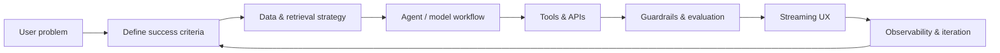

# 👋 Hey, I'm Lalit Sharma

### Full-Stack Engineer · AI Engineer · Builder of Production AI Systems

I design, build, and ship products end-to-end - from the database and API layer to delightful interfaces and reliable LLM-powered features.

---

## 🚀 About Me

I'm a full-stack developer and AI engineer with an Electronics & Communications Engineering background and a bias toward shipping real products. I enjoy working across the entire stack: product thinking, system design, type-safe APIs, data modeling, cloud infrastructure, and AI orchestration.

My work focuses on making LLM features useful in production - retrieval quality, latency, rate limiting, graceful failure, observability, and clear user experiences matter as much as the prompt.

### Currently open to opportunities in

**AI Engineering · Full-Stack Development · RAG Systems · Multi-Agent Applications**

---

## 🏆 Featured Work

### 🏰 [DevCastle](https://devcastle.dev) — Developer Community & Market Intelligence Platform

A live developer community platform built and maintained as an independent product.

- Community feeds, nested discussions, rich-text publishing, product launches, voting, bookmarks, and job discovery.
- AI assistant with local embeddings, Upstash Vector retrieval, Groq inference, and multi-agent orchestration with LangGraph.
- Reddit market intelligence pipeline that extracts demand signals, competitor insights, monetization ideas, and go-to-market recommendations.
- Production infrastructure spanning Next.js, TypeScript, Prisma, MySQL, Upstash Redis, Stripe, PostHog, and GitHub Actions.
- Built with attention to caching, rate limiting, type safety, security, and resilient third-party integrations.

### ✈️ [Wayfarer](https://github.com/lalitdotev/wayfarer-multiagent) — Multi-Agent Travel Planner

A collaborative travel-planning system that decomposes a complex request across specialized agents.

- LangGraph state graph with parallel flight, hotel, and itinerary agents.
- Shared agent state and PostgreSQL persistence for resumable planning sessions.
- Streamlit interface for interactive planning and review.
- Designed around separation of concerns, deterministic orchestration, and recoverable workflows.

### 📈 Reddit Market Intelligence

An automated opportunity-discovery system for SaaS and developer products.

- Collects and processes discussions from relevant Reddit communities.
- Uses LLM extraction to identify pain points, demand strength, competitors, pricing, and launch strategy.
- Combines caching, rate limiting, structured outputs, and human-readable reports.
- Demonstrates an end-to-end pipeline from raw community data to actionable product insight.

---

## 🧠 What I Bring to an AI Engineering Team

| Area | What I build |
| --- | --- |
| **RAG Systems** | Embedding pipelines, hybrid retrieval, vector search, reranking, context construction, and retrieval evaluation |
| **Multi-Agent Systems** | LangGraph workflows, specialized agents, shared state, tool use, parallel execution, and failure recovery |
| **Production AI** | Streaming, timeouts, retries, rate limits, fallbacks, observability, cost controls, and safe output handling |
| **Full-Stack Product** | Next.js applications, APIs, authentication, databases, payments, analytics, and responsive UI |
| **Data Engineering** | Prisma schemas, relational modeling, caching layers, background jobs, and external API integrations |
| **Reliability** | Type safety, testing, CI/CD, secret scanning, structured logging, and graceful degradation |

---

## 🛠️ Technical Toolbox

### Languages

### Frontend & Product

### Backend & Data

### AI, Agents & Retrieval

### Infrastructure & Delivery

---

## 📊 GitHub Profile

---

## 🧭 How I Approach AI Product Work

I start with the user outcome, not the model. Then I design the smallest reliable system that can reach it — with explicit failure modes, measurable quality, and a path to improve over time.

---

## 🎓 Certifications & Learning

- **AWS Certified** — Cloud Technical Essentials, Coursera (98%)
- Continuous learning across distributed systems, applied AI, product engineering, and cloud architecture

---

## 📫 Let's Build Something Useful

I'm interested in conversations about:

- AI engineering and applied LLM product development
- RAG, evaluation, and multi-agent systems
- Full-stack product engineering
- Developer tools and community platforms
- Turning ambiguous ideas into shipped, maintainable software

---

### 🚀 From idea to production — with engineering judgment at every layer.

